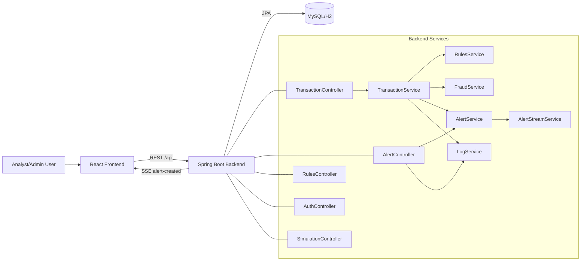
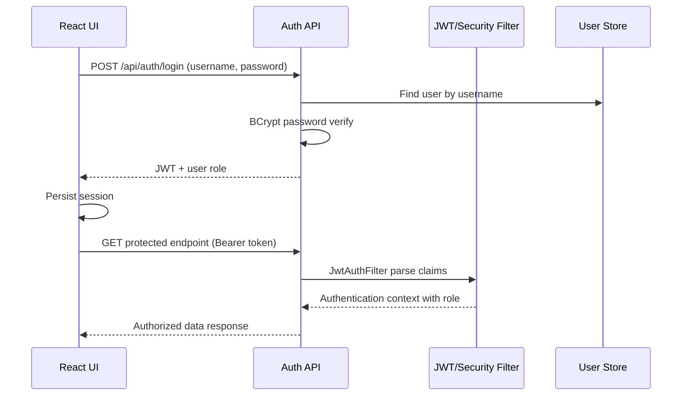

# 01 Technical Proficiency and Dual-Skilling

## Scope and Evidence Basis
This assessment is based on repository evidence across backend (Spring Boot), frontend (React), SQL schema files, containerization assets, automation scripts, and test source files.

Repository artifact evidence available.
Git history unavailable in current snapshot.

Status conventions used in this document:
- Implemented Features
- Partially Implemented
- In Progress Features
- Future Sprint Backlog

---

## 1. Project Technology Overview

### Frontend technologies
- React with Vite build tooling.
- React Router for protected and nested route navigation.
- Context API for authentication state and monitoring data state.
- Axios for REST API integration and bearer-token request interception.
- Recharts for dashboard visualizations.
- CSS modules/stylesheets for UI layout and theme behavior.

### Backend technologies
- Spring Boot with layered architecture (controller, service, repository, entity).
- Spring Security with JWT-based stateless authentication.
- Spring Data JPA for persistence abstraction.
- Scheduled execution via Java scheduler component for transaction simulation.
- Server-Sent Events (SSE) for real-time alert streaming.

### Database technologies
- MySQL-oriented schema and dockerized MySQL service.
- H2 profile used in tests and local test-oriented runtime contexts.
- SQL schema with relational entities: users, transactions, rules, alerts, logs.

### Development tools
- Maven wrapper and Maven lifecycle for backend build and verify.
- npm tooling for frontend package management and scripts.
- ESLint for frontend static quality checks.
- PowerShell and Node scripts for API smoke and integration flow verification.

### Testing tools
- JUnit and Mockito for backend service/controller tests.
- Spring Boot context test for wiring and repository reachability.
- Vitest with Testing Library and jsdom for frontend unit tests.
- Jacoco Maven plugin configured for backend coverage reports.

### Deployment technologies
- Multi-stage Dockerfiles for backend and frontend.
- Nginx frontend runtime container with API reverse-proxy route.
- Docker Compose stack for MySQL + backend + frontend.
- Jenkins pipeline for compose build, deploy, health check, and post cleanup.

### Repository traceability table

| Feature | Repository Evidence | Files | Status |
|---|---|---|---|
| React frontend with protected routes | BrowserRouter, nested routes, ProtectedRoute wrapper | frontend/src/App.jsx; frontend/src/components/Layout/ProtectedRoute.jsx | Implemented |
| JWT-authenticated backend | Security filter chain, JWT filter, token generation | backend/src/main/java/com/transactionmonitoring/backend/config/SecurityConfig.java; backend/src/main/java/com/transactionmonitoring/backend/security/JwtAuthFilter.java; backend/src/main/java/com/transactionmonitoring/backend/security/JwtUtil.java | Implemented |
| Rule-based monitoring engine | Amount, velocity, new payee, daily limit checks | backend/src/main/java/com/transactionmonitoring/backend/service/RulesService.java | Implemented |
| Fraud classification bands | NORMAL, SUSPICIOUS, FRAUDULENT scoring logic | backend/src/main/java/com/transactionmonitoring/backend/service/FraudService.java | Implemented |
| Containerized deployment | Compose stack, Dockerfiles, nginx proxy | docker-compose.yml; backend/Dockerfile; frontend/Dockerfile; frontend/nginx/default.conf | Implemented |
| Automated tests | Backend JUnit tests and frontend Vitest tests | backend/src/test/java/**; frontend/src/**/*.test.* | Implemented |

---

## 2. Technical Architecture Understanding

### Implemented architecture flow

### Frontend flow
1. User authenticates via login page.
2. Auth context stores JWT/session in localStorage or sessionStorage.
3. Protected routes are unlocked for authenticated sessions.
4. App data context loads transactions, rules, and alerts.
5. Alerts stream is opened using SSE endpoint with token query parameter.
6. New alert events trigger in-app notifications and data reload.

### Backend request flow
1. Request enters controller endpoint.
2. Security filter chain applies JWT parsing and route authorization rules.
3. Service layer executes business logic (rules, scoring, status changes).
4. Repository layer persists/retrieves entities.
5. For alert creation, SSE publish is triggered.
6. Response is returned to frontend with normalized payload.

### Database interaction
- JPA repositories provide CRUD and targeted query methods.
- Rule checks call account/time-window queries and count-by-payee queries.
- Rollback flow updates original transaction, creates refund transaction, and writes status logs.

### Authentication flow

### API communication
- REST endpoints support auth, transactions, alerts, rules, simulator, and logs.
- SSE endpoint supports real-time alert-created events.
- Frontend maps backend entities into UI-oriented view models via adapter functions.

### Repository traceability table

| Feature | Repository Evidence | Files | Status |
|---|---|---|---|
| Auth request flow | Login, forgot-password, reset-password, me endpoints | backend/src/main/java/com/transactionmonitoring/backend/controller/AuthController.java | Implemented |
| Protected frontend routing | Redirect to /login when unauthenticated | frontend/src/components/Layout/ProtectedRoute.jsx | Implemented |
| SSE alert stream | SseEmitter subscription and EventSource listener | backend/src/main/java/com/transactionmonitoring/backend/controller/AlertStreamController.java; backend/src/main/java/com/transactionmonitoring/backend/service/AlertStreamService.java; frontend/src/context/AppDataContext.jsx | Implemented |
| Alert status updates | PATCH alert status endpoint and activity log retrieval | backend/src/main/java/com/transactionmonitoring/backend/controller/AlertController.java | Implemented |
| Rollback workflow | PATCH rollback endpoint and service orchestration | backend/src/main/java/com/transactionmonitoring/backend/controller/TransactionController.java; backend/src/main/java/com/transactionmonitoring/backend/service/TransactionService.java | Implemented |
| UI data normalization | Adapter functions map backend payloads to UI models | frontend/src/services/adapters.js | Implemented |

### Known Limitations
- Frontend route protection is implemented, but backend authorization is not consistently enforced across all endpoints.
- Transaction and simulator endpoints are explicitly open in backend security configuration, so UI restrictions must not be treated as complete access control.
- No repository-level API specification file is present; API understanding is derived from controllers and service consumers.

---

## 3. Dual-Skilling Evidence

## Implemented Features

### Frontend development
- Protected route architecture, role-aware UI behavior, and dashboard rendering implemented.
- Alert detail workflows include status-note capture and role-conditional rollback action.

### Backend development
- Controllers and service composition implemented for transaction lifecycle, alerting, rules, and logs.
- JWT and method-level authorization present for selected APIs.

### Database design
- Relational schema and seed paths implemented for users, transactions, rules, alerts, and logs.
- Rule and rollback workflows are persisted with linked foreign keys and logs.

### API development
- REST APIs cover operational CRUD and action flows.
- Real-time SSE stream integrated with frontend event subscription.

### Testing
- Backend unit tests cover fraud classification, simulation generation, rollback edge cases, and controller behavior.
- Frontend tests cover login interactions, auth storage behavior, and dashboard rendering states.

### DevOps/containerization
- Docker Compose stack and Dockerfiles implemented.
- Jenkins pipeline implemented for build/deploy/health-check lifecycle.
- Smoke and integration scripts implemented in PowerShell/Node.

## Partially Implemented
- Dual-skilling is strongly evidenced by repository breadth across frontend, backend, database, tests, and deployment assets.
- Team contribution distribution cannot be proven directly from commit authorship in this snapshot.
- Repository artifact evidence available. Git history unavailable in current snapshot.

## In Progress Features
- Repository artifact evidence available. Git history unavailable in current snapshot.
- Manual frontend test-case execution evidence is documented as templates, but pass/fail execution records are not fully populated.

### Repository traceability table

| Feature | Repository Evidence | Files | Status |
|---|---|---|---|
| Frontend development | Pages, shared layout, context, services, component tests | frontend/src/pages/**; frontend/src/context/**; frontend/src/components/** | Implemented |
| Backend development | Controllers, services, repositories, entities | backend/src/main/java/com/transactionmonitoring/backend/** | Implemented |
| Database design | Relational schema and seed SQL | database/schema.sql; database/data.sql | Implemented |
| Testing capability | JUnit/Mockito and Vitest suites | backend/src/test/java/**; frontend/src/**/*.test.* | Implemented |
| DevOps packaging | Compose orchestration, Dockerfiles, Jenkins pipeline | docker-compose.yml; backend/Dockerfile; frontend/Dockerfile; Jenkinsfile | Implemented |
| Team cross-technology authorship proof | No git metadata in current snapshot | Workspace snapshot | Partially Implemented |

### Known Limitations
- Dual-skilling can be demonstrated from the existence of working assets across technology layers, but not from verified per-contributor commit history in the current snapshot.
- Rule-management authorization is enforced in backend code, but rollback visibility is admin-only in the frontend while backend rollback endpoint remains under open transaction routes.

## Future Sprint Backlog
- Expand role-based authorization consistency across all API endpoints.
- Add production-grade secret handling and vault integration.
- Introduce full CI test/quality gates (unit + integration + security scans).

---

## 4. Technical Challenges and Learning

## Implemented Features

| Challenge | Evidence of Solution | Technologies Learned/Applied | Improvement Outcome |
|---|---|---|---|
| Real-time fraud alert visibility | SSE publisher/subscriber flow from backend to React context | Spring SseEmitter, browser EventSource | Implemented live alert transport from backend to UI |
| Transaction rollback traceability | Rollback action updates transaction state and logs status transitions | Service-level orchestration, audit logging patterns | Implemented audit trail for rollback workflow |
| Multi-role behavior alignment | Admin-only rule management actions and rollback button visibility | Role-based UI gating + Spring method security | Partially implemented role separation across UI and selected APIs |
| Rule-driven classification | Rules + scoring combine into fraud status bands | Rule engine style service composition | Implemented NORMAL/SUSPICIOUS/FRAUDULENT classification |
| Environment portability | Dockerized multi-service stack with compose and nginx proxy | Multi-stage Docker builds, compose networking | Implemented repeatable local stack definition |

## Expected Future Benefits
- Faster analyst response time may result from real-time alert delivery, but the repository does not contain timing metrics to verify improvement magnitude.
- Reduced unauthorized modification risk is an intended benefit of role-aware UI and selected backend method security, but authorization is not uniformly enforced across all APIs.
- Faster onboarding and setup consistency are expected from Docker packaging, but no onboarding measurements are present in the repository.

## In Progress Features
- Consolidating configuration consistency across docs and runtime defaults (example: varying local endpoint assumptions in scripts/docs).

### Repository traceability table

| Feature | Repository Evidence | Files | Status |
|---|---|---|---|
| Real-time alert transport | Alert stream publish/subscribe and frontend listener | backend/src/main/java/com/transactionmonitoring/backend/service/AlertStreamService.java; frontend/src/context/AppDataContext.jsx | Implemented |
| Rollback auditability | Rollback transaction flow writes refund transaction and log entries | backend/src/main/java/com/transactionmonitoring/backend/service/TransactionService.java | Implemented |
| Role-aware rules management | Admin mutation guards, analyst/admin read guards | backend/src/main/java/com/transactionmonitoring/backend/controller/RulesController.java | Implemented |
| Admin-only rollback visibility | Rollback button rendered only for admin role | frontend/src/pages/AlertDetailsPage.jsx | Partially Implemented |
| Containerized local stack | Compose, Dockerfiles, reverse proxy | docker-compose.yml; backend/Dockerfile; frontend/Dockerfile; frontend/nginx/default.conf | Implemented |

### Known Limitations
- No repository benchmark, SLA, or lead-time data is available to prove quantitative improvement outcomes.
- Role separation for rollback is only enforced in the UI; backend access control remains broader on transaction routes.

## Future Sprint Backlog
- Add robust validation annotations and DTO constraints at API boundaries.
- Add centralized exception handling and error contract standards.
- Add performance profiling baseline for high transaction volumes.

---

## 5. Future Technical Growth Plan

### Implemented Items (Completed)

| Sprint | Task | Technology | Business Value | Status |
|---|---|---|---|---|
| Sprint 1 | Build JWT-based authentication and protected routing | Spring Security, JWT, React Router | Prevent unauthorized access to monitoring operations | Completed |
| Sprint 1 | Implement core transaction and alert APIs | Spring Boot REST, JPA | Core fraud-monitoring workflow operational | Completed |
| Sprint 2 | Add rule management with role-based controls | PreAuthorize, React role utility | Controlled governance over fraud rule changes | Completed |
| Sprint 2 | Implement real-time alert push notifications | SseEmitter, EventSource | Faster analyst response to high-risk events | Completed |
| Sprint 3 | Implement rollback workflow with logging | Service orchestration, SQL logs | Reversal workflow with audit trace for compliance review | Completed |
| Sprint 3 | Containerize full stack and add pipeline | Docker, Docker Compose, Jenkins | Repeatable deployment and environment consistency | Completed |
| Sprint 3 | Add unit tests for critical services and UI units | JUnit/Mockito, Vitest | Improved regression safety on key business paths | Completed |

### Repository traceability table

| Feature | Repository Evidence | Files | Status |
|---|---|---|---|
| JWT authentication | Login endpoint, JWT utility, request filter | backend/src/main/java/com/transactionmonitoring/backend/controller/AuthController.java; backend/src/main/java/com/transactionmonitoring/backend/security/JwtUtil.java; backend/src/main/java/com/transactionmonitoring/backend/security/JwtAuthFilter.java | Implemented |
| Rule management | Rule CRUD API and frontend rule page | backend/src/main/java/com/transactionmonitoring/backend/controller/RulesController.java; frontend/src/pages/RulesPage.jsx | Implemented |
| Real-time notifications | SSE endpoint and EventSource listener | backend/src/main/java/com/transactionmonitoring/backend/controller/AlertStreamController.java; frontend/src/context/AppDataContext.jsx | Implemented |
| Rollback workflow | Rollback endpoint, service flow, admin UI action | backend/src/main/java/com/transactionmonitoring/backend/controller/TransactionController.java; backend/src/main/java/com/transactionmonitoring/backend/service/TransactionService.java; frontend/src/pages/AlertDetailsPage.jsx | Partially Implemented |
| Automated tests | Backend and frontend test suites | backend/src/test/java/**; frontend/src/**/*.test.* | Implemented |

### Known Limitations
- Sprint labels in this section are documentation structure for planning clarity; the repository does not contain a verifiable sprint tracking system linking each feature to a source-control milestone.
- Repository artifact evidence available. Git history unavailable in current snapshot.

### Future Sprint Backlog

| Sprint | Task | Technology | Business Value | Status |
|---|---|---|---|---|
| Sprint 4 | Enforce authorization on logs and alert mutation endpoints consistently | Spring Security method guards | Reduce access-control exposure surface | Planned |
| Sprint 4 | Replace forgot-password simplified flow with tokenized reset workflow | Secure reset tokens, email/SMS OTP | Stronger account recovery security posture | Planned |
| Sprint 5 | Add integration tests with containerized MySQL and API contract checks | Testcontainers, REST-assured | Production-like confidence for release gates | Planned |
| Sprint 5 | Add dependency and container vulnerability scanning in CI | OWASP Dependency-Check, Trivy | Early risk detection and supply-chain resilience | Planned |
| Sprint 6 | Introduce observability stack for alerts and incidents | Structured logs, metrics, dashboards | Faster incident triage and SLA monitoring | Planned |
