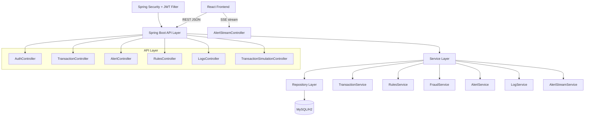

# 02 Solution Design and Implementation

## Scope and Evidence Basis
This document evaluates implemented capabilities from the codebase and repository artifacts. Where capability is not present in code or executable assets, it is marked as future work.

Repository artifact evidence available.
Git history unavailable in current snapshot.

Status conventions used in this document:
- Implemented Features
- Partially Implemented
- In Progress Features
- Future Backlog

---

## 1. Business Problem Statement

Financial institutions process high transaction volumes where suspicious patterns can indicate fraud, account takeover, mule activity, or policy violations. Manual-only review creates lag, inconsistent prioritization, and reduced investigation quality.

Why transaction monitoring is required:
- Detect suspicious behavior early to reduce financial losses.
- Provide traceable alert lifecycle and analyst actions.
- Support risk-based prioritization for operations teams.

Fraud detection importance:
- High-value and high-frequency payments need automated control points.
- New-payee and aggregate-daily behavior patterns can surface hidden risk.

Customer and business impact:
- Faster detection lowers potential fraud exposure.
- Audit logs strengthen investigation defensibility.
- Better workflow tooling improves analyst throughput and response time.

### Repository traceability table

| Feature | Repository Evidence | Files | Status |
|---|---|---|---|
| Business context documentation | Monitoring use cases, alert lifecycle, user stories | docs/UserStories.md; COMPLETE_WORKFLOW_SUMMARY.md; WORKFLOW_DEMO.md | Implemented |
| Fraud rule workflows | Rule checks and fraud classification services | backend/src/main/java/com/transactionmonitoring/backend/service/RulesService.java; backend/src/main/java/com/transactionmonitoring/backend/service/FraudService.java | Implemented |
| Audit trace capability | Logs table and alert log retrieval | database/schema.sql; backend/src/main/java/com/transactionmonitoring/backend/controller/AlertController.java | Implemented |

### Known Limitations
- The repository supports the transaction-monitoring use case technically, but business impact metrics such as loss reduction, analyst throughput increase, or detection latency improvement are not measured in the repository.

---

## 2. Solution Overview

## Implemented Features

### Major features
- Authentication with JWT issuance and protected route behavior.
- Transaction ingestion and rule evaluation.
- Fraud classification (NORMAL, SUSPICIOUS, FRAUDULENT).
- Alert generation and lifecycle updates.
- Real-time alert streaming to frontend notifications.
- Rule catalog management with admin-only mutation.
- Rollback workflow with refund transaction generation and log capture.
- Dockerized deployment assets and Jenkins pipeline.

### User roles
- ADMIN: full monitoring access including rule mutation and rollback action visibility in UI.
- ANALYST: monitoring and investigation actions with restricted rule-management mutation controls.

### Workflows
- Authentication workflow.
- Transaction -> Rules -> Alert creation workflow.
- Alert status lifecycle workflow.
- Rollback workflow with prerequisite check (investigating alert exists).
- Real-time notification workflow via SSE.

### System capabilities
- Monitor transactions and classify risk.
- Maintain alerts and logs.
- Support dashboard, analytics, and queue views.
- Simulate transaction generation for demo/testing flows.

### Repository traceability table

| Feature | Repository Evidence | Files | Status |
|---|---|---|---|
| Authentication workflow | Login and session bootstrap | backend/src/main/java/com/transactionmonitoring/backend/controller/AuthController.java; frontend/src/services/auth.js; frontend/src/context/AuthContext.jsx | Implemented |
| Transaction and alert workflow | Save transaction, evaluate rules, create alerts | backend/src/main/java/com/transactionmonitoring/backend/service/TransactionService.java; backend/src/main/java/com/transactionmonitoring/backend/service/AlertService.java | Implemented |
| Real-time notification workflow | SSE stream endpoint and frontend EventSource listener | backend/src/main/java/com/transactionmonitoring/backend/controller/AlertStreamController.java; frontend/src/context/AppDataContext.jsx | Implemented |
| Rule management workflow | Rule CRUD API and role-aware rule page | backend/src/main/java/com/transactionmonitoring/backend/controller/RulesController.java; frontend/src/pages/RulesPage.jsx | Implemented |
| Rollback workflow | Backend rollback endpoint plus admin-only frontend action | backend/src/main/java/com/transactionmonitoring/backend/controller/TransactionController.java; backend/src/main/java/com/transactionmonitoring/backend/service/TransactionService.java; frontend/src/pages/AlertDetailsPage.jsx | Partially Implemented |

### Known Limitations
- Rollback is admin-only in the frontend UI, but backend transaction routes are open by current security configuration. UI restriction exists, but backend enforcement does not consistently match it.
- Repository artifact evidence available. Git history unavailable in current snapshot.

## In Progress Features
- Some project documentation states single-operator model while runtime includes ADMIN and ANALYST roles. Documentation alignment is in progress.

## Future Backlog
- Transaction blocker mechanism requested in meeting notes is not currently implemented. Recommended future sprint item.
- Tokenized/OTP-based password reset is not currently implemented. Recommended future sprint item.

---

## 3. System Architecture

### Frontend architecture
- Route-driven single-page app with protected shell layout.
- Auth context and app-data context provide shared state.
- Adapter layer normalizes backend payloads for UI components.

### Backend architecture
- Standard layered Spring architecture.
- Security filter chain and method-level authorization for selected endpoints.
- Services encapsulate rule checks, scoring, alert generation, and rollback orchestration.

### Database architecture
- Core entities: users, transactions, rules, alerts, logs.
- Foreign key links: alerts -> transactions/rules, logs -> alerts.
- Seeders provide demo users/transactions/rules/alerts.

### API design
- REST resource endpoints for transactions, alerts, rules, logs, auth, simulator.
- SSE endpoint for live alert event stream.

### Known Limitations
- No OpenAPI or generated API specification file is present in the repository. API design evidence is derived from controllers, scripts, and frontend service consumers.

---

## 4. Feature Documentation

## Implemented Features

### Feature Name: Authentication and Session Management
Purpose: Restrict access to monitoring workspace and APIs.
User Flow: User logs in -> receives JWT -> accesses protected routes and APIs.
Backend Implementation: Auth controller with BCrypt verification and JWT issuance.
Frontend Implementation: Login page + auth service + context-based session state.
Database Changes: users table with username, employee id, password hash, role.
Testing: Frontend auth service tests for storage behavior.
Current Status: Implemented.

Repository Evidence: Auth endpoints, JWT utility, auth service storage handling.
Files: backend/src/main/java/com/transactionmonitoring/backend/controller/AuthController.java; backend/src/main/java/com/transactionmonitoring/backend/security/JwtUtil.java; frontend/src/services/auth.js; frontend/src/services/auth.test.js

### Feature Name: Transaction Monitoring and Listing
Purpose: Persist and review transaction activity.
User Flow: User views transactions list with search/filter/sort.
Backend Implementation: Transaction CRUD endpoints and persistence.
Frontend Implementation: Transactions page with filters, pagination, badges.
Database Changes: transactions table.
Testing: Backend service tests validate save behavior and status handling.
Current Status: Implemented.

Repository Evidence: Transaction controller/service, transaction page filters and pagination, save path tests.
Files: backend/src/main/java/com/transactionmonitoring/backend/controller/TransactionController.java; backend/src/main/java/com/transactionmonitoring/backend/service/TransactionService.java; frontend/src/pages/TransactionsPage.jsx; backend/src/test/java/com/transactionmonitoring/backend/service/TransactionServiceTest.java

### Feature Name: Rule Engine Checks
Purpose: Detect policy violations (amount, velocity, new payee, daily total).
User Flow: Transaction submission triggers rule checks.
Backend Implementation: Rules service evaluates active rules and violations.
Frontend Implementation: Rules management/listing page with role-based actions.
Database Changes: rules table with threshold/time-window/active fields.
Testing: Covered indirectly through transaction/fraud/rollback tests.
Current Status: Implemented.

Repository Evidence: Rule-check methods for threshold, velocity, new payee, and daily total.
Files: backend/src/main/java/com/transactionmonitoring/backend/service/RulesService.java; backend/src/main/java/com/transactionmonitoring/backend/controller/RulesController.java

### Feature Name: Fraud Risk Classification
Purpose: Prioritize alerts through risk categorization.
User Flow: Transaction receives fraud status NORMAL/SUSPICIOUS/FRAUDULENT.
Backend Implementation: Fraud scoring service with configurable threshold rule.
Frontend Implementation: Risk badge rendering on transaction and alert views.
Database Changes: fraud status persisted in transaction records.
Testing: Dedicated fraud service unit tests.
Current Status: Implemented.

Repository Evidence: Score accumulation logic and threshold rule lookup; unit tests for all three outcome bands.
Files: backend/src/main/java/com/transactionmonitoring/backend/service/FraudService.java; backend/src/test/java/com/transactionmonitoring/backend/service/FraudServiceTest.java

### Feature Name: Alert Generation and Lifecycle
Purpose: Track suspicious events and investigation state.
User Flow: Alert appears in queue -> analyst/admin updates status with note.
Backend Implementation: Alert service create/update + logs creation.
Frontend Implementation: Alerts list and alert-details actions/modals.
Database Changes: alerts and logs tables.
Testing: Status and rollback behavior covered in backend tests.
Current Status: Implemented.

Repository Evidence: Alert creation, alert status patch endpoint, alert log retrieval, alert details UI actions.
Files: backend/src/main/java/com/transactionmonitoring/backend/service/AlertService.java; backend/src/main/java/com/transactionmonitoring/backend/controller/AlertController.java; frontend/src/pages/AlertsPage.jsx; frontend/src/pages/AlertDetailsPage.jsx

### Feature Name: Real-Time Alert Streaming
Purpose: Minimize delay between detection and analyst awareness.
User Flow: New alert event appears as notification and refreshed dashboard data.
Backend Implementation: SseEmitter subscription and broadcast service.
Frontend Implementation: EventSource listener in app-data context.
Database Changes: None required for transport channel.
Testing: Not covered by dedicated automated test in repository.
Current Status: Implemented.

Repository Evidence: Alert stream endpoint, emitter publish method, EventSource subscription.
Files: backend/src/main/java/com/transactionmonitoring/backend/controller/AlertStreamController.java; backend/src/main/java/com/transactionmonitoring/backend/service/AlertStreamService.java; frontend/src/context/AppDataContext.jsx

### Feature Name: Transaction Rollback
Purpose: Reverse investigated suspicious transactions with auditable records.
User Flow: Admin triggers rollback from alert details after investigation state is met.
Backend Implementation: Rollback method updates original transaction, creates refund transaction, updates alerts, inserts logs.
Frontend Implementation: Admin-only rollback action in alert details; note capture modal.
Database Changes: transaction investigation status and logs updated; refund record inserted.
Testing: Multiple rollback edge-case unit tests present.
Current Status: Partially Implemented.

Repository Evidence: Rollback endpoint, refund creation, alert log write, admin-only rollback button in UI.
Files: backend/src/main/java/com/transactionmonitoring/backend/controller/TransactionController.java; backend/src/main/java/com/transactionmonitoring/backend/service/TransactionService.java; frontend/src/pages/AlertDetailsPage.jsx; backend/src/test/java/com/transactionmonitoring/backend/service/TransactionServiceTest.java

Known Limitation: UI restriction exists, but backend enforcement does not consistently restrict rollback to admin-only access because transaction routes are open in backend security configuration.

### Feature Name: Simulation and Coverage Data Generation
Purpose: Create deterministic/random flows for demo and system validation.
User Flow: API calls start/stop simulator or generate batches.
Backend Implementation: Scheduler + simulation service + random generator.
Frontend Implementation: No direct simulator UI control observed.
Database Changes: Inserts generated transactions and downstream alerts/logs.
Testing: Simulation service and controller tests.
Current Status: Implemented.

Repository Evidence: Scheduler controls, random generator, coverage batch endpoint, unit/controller tests.
Files: backend/src/main/java/com/transactionmonitoring/backend/controller/TransactionSimulationController.java; backend/src/main/java/com/transactionmonitoring/backend/service/TransactionSimulationService.java; backend/src/main/java/com/transactionmonitoring/backend/simulation/SimulatorSchedular.java; backend/src/test/java/com/transactionmonitoring/backend/service/TransactionSimulationServiceTest.java; backend/src/test/java/com/transactionmonitoring/backend/controller/TransactionSimulationControllerTest.java

### Feature Name: Settings Persistence
Purpose: Persist user-configurable monitoring preferences.
User Flow: User changes preferences and saves.
Backend Implementation: Not currently implemented. Recommended future sprint item.
Frontend Implementation: Settings page currently presents static form controls.
Database Changes: Not currently implemented. Recommended future sprint item.
Testing: Not currently implemented. Recommended future sprint item.
Current Status: Partially Implemented.

Repository Evidence: Static settings form only.
Files: frontend/src/pages/SettingsPage.jsx

Known Limitation: Save action has no backend persistence, no API integration, and no stored preference model.

### Feature Name: Transaction Blocking
Purpose: Prevent suspicious transactions from being processed pre-settlement.
User Flow: Transaction flagged and blocked before completion.
Backend Implementation: Not currently implemented. Recommended future sprint item.
Frontend Implementation: Not currently implemented. Recommended future sprint item.
Database Changes: Not currently implemented. Recommended future sprint item.
Testing: Not currently implemented. Recommended future sprint item.
Current Status: Future Backlog.

---

## 5. Development Practices

## Implemented Features
- Agile-style progression evidence exists in meeting notes with dated action items and follow-ups.
- Requirement clarification occurred through customer review loops and MoM records.
- Modular controllers, services, repositories, and components show structured implementation boundaries.
- Team published commit discipline guidance for small, focused commits.
- Jenkins deployment stages and smoke scripts indicate delivery discipline.

## Partially Implemented
- Repository artifact evidence supports planning rhythm and project coordination through meeting minutes and commit-guidance documentation.
- Repository artifact evidence available. Git history unavailable in current snapshot.

## In Progress Features
- Formal pull-request template and review checklist evidence is not present in repository snapshot.

### Repository traceability table

| Feature | Repository Evidence | Files | Status |
|---|---|---|---|
| Requirement clarification | Meeting minutes and user stories | docs/MoM/**; docs/UserStories.md | Implemented |
| Commit guidance | Commit cadence document | docs/Commit_Cadence_Guide.md | Implemented |
| Delivery automation | Jenkins pipeline and smoke scripts | Jenkinsfile; scripts/api-smoke.ps1; scripts/api-smoke-v2.ps1; scripts/integration-flow.ps1 | Implemented |
| Actual commit-history analysis | .git metadata absent from workspace snapshot | Workspace snapshot | Partially Implemented |

### Known Limitations
- Development-process claims are supported by repository artifacts and documentation, not by verifiable source-control history in the current snapshot.

## Future Backlog
- Add branch protection rules and mandatory review checks in hosting platform.
- Introduce definition-of-done gates (tests, lint, security scan, docs update).

---

## 6. Git Discipline

## Implemented Features
- Repository contains commit cadence guidance with recommended commit categories and cadence expectations.
- Project documents mention merge conflict resolution and branch integration activities.

## In Progress Features
- Repository artifact evidence available. Git history unavailable in current snapshot.

## Good commit examples (recommended patterns aligned to current project)
- feat(transaction): add rollback endpoint with refund transaction creation
- fix(alert): validate status payload and return consistent bad-request responses
- refactor(rules): separate threshold and velocity checks for readability
- test(simulator): add controller tests for start/stop and coverage batch endpoints

## Recommended future commit format
- feat(transaction): add fraud rule evaluation API
- fix(alert): resolve alert filtering issue
- test(service): add transaction service tests

### Repository traceability table

| Feature | Repository Evidence | Files | Status |
|---|---|---|---|
| Commit-style guidance | Commit examples and guardrails | docs/Commit_Cadence_Guide.md | Implemented |
| Team integration evidence | Meeting notes referencing conflict resolution and branch integration | docs/MoM/MoM_2026-08-04.md; docs/MoM/MoM_2026-08-05.md | Implemented |
| Actual commit quality review | No git log in workspace snapshot | Workspace snapshot | Partially Implemented |

---

## 7. Future Enhancement Backlog (Prioritized)

| Priority | Feature | Reason | Sprint |
|---|---|---|---|
| P1 | Secure password reset flow with expiring token/OTP | Current reset flow is simplified and high risk for production | Sprint 4 |
| P1 | Enforce authorization consistently on logs and alert mutation endpoints | Reduce broken access control risk | Sprint 4 |
| P1 | Transaction blocker workflow | Customer-requested control to stop suspicious payments | Sprint 4 |
| P2 | API integration tests with containerized database | Improve release confidence and regression detection | Sprint 5 |
| P2 | CI vulnerability scanning for dependencies/images | Reduce supply-chain risk exposure | Sprint 5 |
| P3 | Settings persistence and preferences API | Convert static UI controls into operational capabilities | Sprint 5 |
| P3 | Centralized audit and observability dashboards | Improve monitoring and compliance reporting | Sprint 6 |

---

## 8. Testing Strategy

## Implemented Features

### Unit tests
- Backend service tests for fraud classification, transaction save behavior, rollback edge cases.
- Frontend tests for login component behavior, auth session storage logic, dashboard rendering/error states.

### Integration tests
- Spring Boot context test validates bean wiring and repository reachability.
- PowerShell/Node integration flow scripts validate cross-endpoint scenarios.

### API testing
- Smoke scripts cover auth, rules CRUD, transactions, alerts, rollback, simulator, and logs endpoints.

### Frontend testing
- Vitest + Testing Library setup supports component and service-level test coverage.

### Repository traceability table

| Feature | Repository Evidence | Files | Status |
|---|---|---|---|
| Backend unit tests | Fraud, transaction, simulation service tests | backend/src/test/java/com/transactionmonitoring/backend/service/FraudServiceTest.java; backend/src/test/java/com/transactionmonitoring/backend/service/TransactionServiceTest.java; backend/src/test/java/com/transactionmonitoring/backend/service/TransactionSimulationServiceTest.java | Implemented |
| Backend controller/context tests | Simulation controller and Spring Boot context tests | backend/src/test/java/com/transactionmonitoring/backend/controller/TransactionSimulationControllerTest.java; backend/src/test/java/com/transactionmonitoring/backend/BackendApplicationTests.java | Implemented |
| Frontend unit tests | Login component, auth service, dashboard page tests | frontend/src/components/LoginCard.test.jsx; frontend/src/services/auth.test.js; frontend/src/pages/DashboardPage.test.jsx | Implemented |
| Browser end-to-end automation | No Cypress/Playwright or equivalent suite in repository | Repository snapshot | Future Sprint |

### Known Limitations
- Test coverage breadth is stronger at service/unit level than at browser-level end-to-end workflow level.
- No coverage threshold enforcement or CI test gate is implemented in the current pipeline.

## In Progress Features
- Full end-to-end browser automation suite is not currently implemented. Recommended future sprint item.
- Contract testing between frontend adapters and backend payload schemas is not currently implemented. Recommended future sprint item.

## Future Backlog
- Add CI test matrix (backend unit + frontend unit + API smoke + security scan).
- Add coverage thresholds and quality gates per module.
